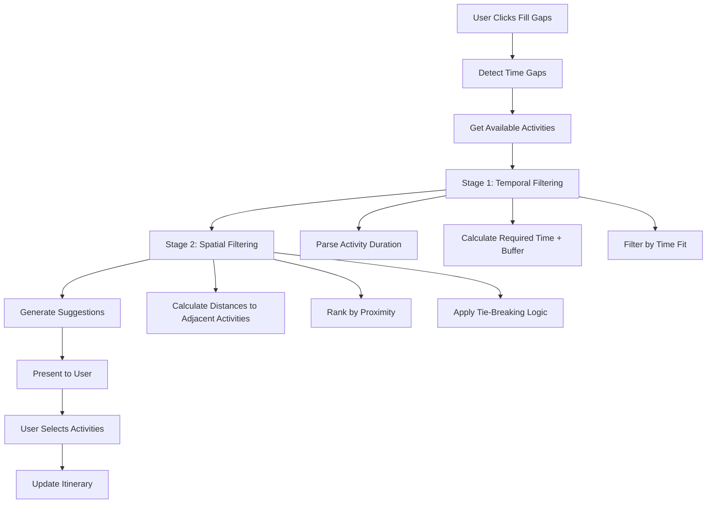

# Intelligent Gap-Filling Algorithm Design
## TetrisTravel Itinerary Optimization System

### Executive Summary

This document outlines the design for an intelligent gap-filling algorithm that implements a two-stage filtering system to optimize itinerary scheduling. The algorithm prioritizes duration-first optimization with spatial proximity as a secondary factor, integrating seamlessly with the existing TetrisTravel architecture.

### System Architecture Overview



### Core Algorithm Specifications

#### 1. Two-Stage Filtering System

**Stage 1: Temporal Filtering**
- **Input**: Time gaps (≥30 minutes), available activities
- **Process**: 
  - Parse activity duration from string format (e.g., "2 hours" → 120 minutes)
  - Add 20-minute buffer time for travel/transitions
  - Filter activities where `activityDuration + bufferTime ≤ gapDuration`
- **Output**: Time-compatible activities list

**Stage 2: Spatial Filtering**
- **Input**: Time-compatible activities, gap context (preceding/following activities)
- **Process**:
  - Calculate distances using turf.js to both adjacent activities
  - Rank by minimum distance to either adjacent activity
  - Apply duration-first tie-breaking (prefer activities that use more available time)
- **Output**: Ranked activity suggestions (max 3 per gap)

#### 2. Integration Points

**Primary Integration**: [`ItineraryPanel.tsx:366-414`](components/ItineraryPanel.tsx:366-414)
- Add "Fill Gaps" button in gap detection blocks
- Replace static recommendation carousel with intelligent suggestions
- Maintain existing UI patterns and styling

**Data Flow Integration**: [`lib/context/AppContext.tsx`](lib/context/AppContext.tsx)
- Extend context with gap-filling functions
- Leverage existing `availableRecommendations` filtering
- Use current `addItineraryEvent` for seamless integration

**Gap Detection Enhancement**: [`src/contracts/itinerary.ts:70-152`](src/contracts/itinerary.ts:70-152)
- Extend `detectTimeGaps` function with buffer time parameter
- Add gap metadata (adjacent activities, optimal duration)
- Maintain backward compatibility with existing implementation

### Technical Implementation Details

#### 3. Core Algorithm Module Structure

```typescript
// lib/gapFillingAlgorithm.ts
interface GapFillingOptions {
  bufferTimeMinutes: number; // Default: 20
  minGapMinutes: number; // Default: 30
  maxSuggestionsPerGap: number; // Default: 3
  prioritizeDistance: boolean; // Default: false (duration-first)
}

interface GapSuggestion {
  activity: Recommendation;
  gap: TimeGap;
  distanceToNext: number;
  distanceToPrevious: number;
  timeUtilization: number; // Percentage of gap used
  confidence: number; // Algorithm confidence score
}

export function findOptimalActivitiesForGaps(
  gaps: TimeGap[],
  availableActivities: Recommendation[],
  itineraryEvents: ItineraryEvent[],
  options: GapFillingOptions = DEFAULT_OPTIONS
): Map<string, GapSuggestion[]>
```

#### 4. Distance Calculation Strategy

**Library**: turf.js for precise geospatial calculations
- **Method**: `turf.distance()` with 'kilometers' units
- **Fallback**: Existing Haversine implementation in [`lib/itineraryUtils.ts`](lib/itineraryUtils.ts)
- **Caching**: LRU cache for distance calculations (performance optimization)

```typescript
// Distance calculation with caching
const distanceCache = new Map<string, number>();

function calculateCachedDistance(
  from: { lat: number; lng: number },
  to: { lat: number; lng: number }
): number {
  const key = `${from.lat},${from.lng}-${to.lat},${to.lng}`;
  if (distanceCache.has(key)) {
    return distanceCache.get(key)!;
  }
  
  const distance = turf.distance(
    [from.lng, from.lat],
    [to.lng, to.lat],
    { units: 'kilometers' }
  );
  
  distanceCache.set(key, distance);
  return distance;
}
```

#### 5. Duration Parsing Logic

**Input Formats Supported**:
- "2 hours" → 120 minutes
- "1.5 hours" → 90 minutes  
- "45 minutes" → 45 minutes
- "1h 30m" → 90 minutes
- Fallback: 120 minutes (2 hours default)

```typescript
function parseActivityDuration(durationString?: string): number {
  if (!durationString) return 120; // Default 2 hours
  
  const hourMatch = durationString.match(/(\d+(?:\.\d+)?)\s*h(?:ours?)?/i);
  const minuteMatch = durationString.match(/(\d+)\s*m(?:in(?:utes?)?)?/i);
  
  let totalMinutes = 0;
  if (hourMatch) totalMinutes += parseFloat(hourMatch[1]) * 60;
  if (minuteMatch) totalMinutes += parseInt(minuteMatch[1]);
  
  return totalMinutes || 120; // Fallback to 2 hours
}
```

### User Experience Design

#### 6. UI Integration Specifications

**Gap Detection Enhancement**:
- Modify existing gap blocks in [`ItineraryPanel.tsx:366-414`](components/ItineraryPanel.tsx:366-414)
- Replace static recommendation carousel with intelligent suggestions
- Add "Fill Gaps" button with loading states and success feedback

**Visual Indicators**:
- Confidence scoring visualization (1-3 stars)
- Distance indicators ("5 min walk", "15 min transit")
- Time utilization bars showing gap usage efficiency

**User Feedback Loop**:
- Track user selections to improve algorithm confidence
- "Not interested" option to exclude activities from future suggestions
- Success metrics: gap fill rate, user satisfaction scores

#### 7. Error Handling & Edge Cases

**Edge Case Management**:
- **No suitable activities**: Show "No activities fit this time slot" message
- **Single activity in itinerary**: Use city center or user location as reference point
- **Activities without duration**: Apply 2-hour default with user notification
- **Invalid coordinates**: Skip activity with warning log
- **Network failures**: Graceful degradation to existing static recommendations

**Performance Safeguards**:
- Maximum 50 activities processed per gap (prevent UI freezing)
- 5-second timeout for distance calculations
- Progressive loading for large activity datasets

### Performance Considerations

#### 8. Optimization Strategies

**Computational Complexity**:
- Time Complexity: O(G × A × log A) where G = gaps, A = activities
- Space Complexity: O(A) for distance caching
- Target Performance: <200ms for typical datasets (5 gaps, 100 activities)

**Caching Strategy**:
- Distance calculations cached with LRU eviction (max 1000 entries)
- Activity duration parsing cached per session
- Gap detection results cached until itinerary changes

**Memory Management**:
- Lazy loading of turf.js library (code splitting)
- Cleanup of distance cache on component unmount
- Debounced gap recalculation on itinerary updates

### Data Structure Extensions

#### 9. Type Definitions

```typescript
// lib/types.ts extensions
export interface EnhancedTimeGap extends TimeGap {
  id: string;
  precedingActivity?: ItineraryEvent;
  followingActivity?: ItineraryEvent;
  optimalDurationMinutes: number;
  context: 'morning' | 'afternoon' | 'evening';
}

export interface GapFillingResult {
  gapId: string;
  suggestions: GapSuggestion[];
  processingTimeMs: number;
  confidence: 'high' | 'medium' | 'low';
}
```

### Testing Strategy

#### 10. Test Coverage Requirements

**Unit Tests**:
- Duration parsing with various input formats
- Distance calculation accuracy vs. Haversine baseline
- Temporal filtering edge cases (boundary conditions)
- Spatial filtering ranking consistency

**Integration Tests**:
- End-to-end gap filling workflow
- UI interaction with gap suggestions
- Context integration with existing itinerary management
- Performance benchmarks with large datasets

**User Acceptance Tests**:
- Gap filling improves itinerary efficiency
- Suggestions are geographically logical
- UI remains responsive during processing
- Error states provide clear user guidance

### Implementation Phases

#### Phase 1: Core Algorithm (Tasks 1-4)
- Add turf.js dependency
- Implement core gap-filling algorithm
- Create utility functions for duration parsing
- Enhance gap detection with buffer time

#### Phase 2: UI Integration (Tasks 5-7)
- Add gap-filling components to ItineraryPanel
- Integrate with AppContext
- Implement user interaction flows

#### Phase 3: Polish & Optimization (Tasks 8-12)
- Add comprehensive error handling
- Implement performance optimizations
- Create test suite
- Add user feedback mechanisms

### Success Metrics

**Technical Metrics**:
- Algorithm processing time <200ms for typical use cases
- Distance calculation accuracy within 1% of reference implementations
- Zero crashes or UI freezing during gap filling operations

**User Experience Metrics**:
- Gap fill acceptance rate >60%
- User satisfaction with suggestions >4/5 stars
- Reduced manual itinerary adjustment time by 40%

**Business Impact**:
- Increased user engagement with itinerary planning features
- Higher completion rates for comprehensive itineraries
- Improved user retention through enhanced planning experience

---

This design provides a comprehensive blueprint for implementing the intelligent gap-filling algorithm while maintaining compatibility with the existing TetrisTravel architecture and ensuring optimal user experience.